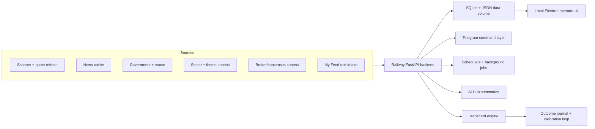

# Trading Copilot / AstraEdge

AstraEdge is a safety-first market intelligence copilot for Indian equities. It combines scanner data, market context, news, macro signals, user-supplied feed items, and outcome learning into Telegram-first research workflows.

The system is designed for **research and paper-trading intelligence only**. It is not a broker, not an execution bot, and does not place automated or one-click orders.

- **Current build:** AstraEdge 50Z
- **Primary interface:** Telegram bot
- **Deployment:** Railway production FastAPI backend
- **Persistence:** SQLite and JSON artifacts on a Railway **Persistent volume** mounted at `/app/data`
- **Local operator UI:** Electron desktop interface for monitoring and review

---

## What It Does

Trading Copilot helps an operator answer:

- What is moving in the Indian market?
- Which names have scanner, news, sector, macro, or catalyst support?
- Is the current market mode suitable for active paper-trade planning?
- Has a tradecard remained active, missed entry, or moved into next-session watch?
- How have prior paper tradecards and intelligence calls resolved?

It does **not** convert research into real-money execution. Any real-world decision must be verified manually by the user.

---

## Core Capabilities

| Area | Capability |
| --- | --- |
| Market intelligence ingestion | Live scanner and quote refresh, news cache, government and macro intelligence, sector and theme context, global market context, broker or consensus context where available |
| My Feed | Text-based user news intake for market-relevant items supplied directly through Telegram |
| Decision context | NSE-focused intelligence, freshness checks, market-mode awareness, catalyst and scanner confluence |
| Tradecards | Paper-only research cards with deterministic safety gates, entry-zone context, stop, T1/T2, confidence, source, and freshness |
| Outcome learning | Tradecard journal, fill and target/stop sequencing, pending outcome review, calibration views |
| Telegram operations | On-demand commands, scheduled briefs, status checks, refresh commands, AI Hub summaries |
| Local review | Electron UI for operator monitoring, runtime inspection, and cached data review |

---

## Safety-First Tradecards

`/tradecard` creates a paper-only research card for one current candidate. The tradecard system is intentionally conservative:

- Blocks active-entry tradecards outside valid market conditions.
- Handles `NO ACTIVE ENTRY`, `ENTRY_MISSED`, `NEXT-SESSION WATCH`, `PREMARKET WATCH`, and `VALID_ENTRY` states.
- Avoids blind entries and requires fresh price and volume confirmation.
- Shows entry zone, stop, T1, T2, confidence, source, and freshness when a valid paper plan exists.
- Uses a repeated same-ticker active lock so one active card is not duplicated.
- Keeps `/tradecard explain` tied to the same latest card or audit card shown by `/tradecard`.
- Tracks paper tradecard outcomes through `/tradecard outcome` and `/tradecard journal`.
- Resolves outcome sequencing through entry fill, T1/T2, stop, no-fill, expiry, and conservative handling for ambiguous same-candle paths.
- Adds tradecard results or provisional review into `/close` when appropriate.

In research mode, premarket, or after-hours contexts, the bot favors watch-only wording such as next-session confirmation instead of presenting stale or non-live context as active.

---

## Telegram Commands

Telegram is the main operational interface for AstraEdge 50Z.

| Category | Commands |
| --- | --- |
| Core | `/status`, `/health`, `/schedule`, `/memory`, `/broker`, `/qa` |
| Action | `/action plan`, `/bootstrap`, `/today`, `/tomorrow`, `/why <ticker>`, `/premarket`, `/premarket full` |
| Refresh | `/refresh`, `/refresh quick`, `/refresh full` |
| AI Hub | `/aihub`, `/aihub full`, `/aihub brain`, `/aihub govt`, `/aihub scan`, `/aihub market`, `/aihub global`, `/aihub news`, `/aihub tv`, `/aihub calib`, `/aihub journal`, `/aihub brain full` |
| My Feed | `/feed <market news text>`, `/myfeed list`, `/myfeed today`, `/myfeed scan`, `/myfeed clean-old` |
| Catalyst Radar | `/catalysts`, `/catalysts today`, `/catalysts explain <ticker>` |
| Trade Card | `/tradecard`, `/tradecard today`, `/tradecard explain`, `/tradecard outcome`, `/tradecard journal` |
| Briefs | `/news`, `/morning`, `/close`, `/full` |
| Theme Wishlist | `/theme`, `/theme <basket>`, `/theme news`, `/theme scan`, `/theme budget`, `/theme refresh` |
| Budget Impact | `/budget`, `/budget theme <basket>`, `/budget analyze <text>` |
| AI | `/ask ai <question>` |

---

## Market Modes

AstraEdge is market-mode aware and changes wording based on whether live confirmation is possible.

| Mode | Meaning | Typical behavior |
| --- | --- | --- |
| `INDIA_PREMARKET_MODE` | Before the regular session | Research and preparation only; active tradecards are blocked until market confirmation is available |
| `INDIA_PREOPEN_MODE` | NSE pre-open window | Opening context and confirmation prep; no live active-entry assumption |
| `INDIA_MARKET_HOURS` | Regular India market session | Live scanner and quote context may support paper tradecards when all safety gates pass |
| `RESEARCH_MODE` | Weekend, holiday, closed-market, or research-only state | No live intraday/EOD confirmation; stale report packs are not presented as current |
| After-hours / post-market | Closed-market review and next-session prep | Watch-only wording, outcome review, and next-session confirmation plans |

---

## AI Role

AI is used as an assistant layer for:

- Summarization and explanation.
- Normalizing noisy market text into structured context.
- Synthesizing scanner, news, macro, sector, and user-feed inputs.
- Helping answer `/ask ai` questions using cached system context.

The final tradecard safety gates are rule-based and deterministic. AI does not place trades, bypass safety checks, or make execution decisions. Provider routing is budget-aware and has fallback behavior, but public operation does not depend on exposing provider account details.

---

## Architecture



### Main Components

| Component | Role |
| --- | --- |
| Railway FastAPI service | Production backend, health endpoints, data APIs, background startup |
| Telegram command layer | Main operator interface and scheduled briefs |
| Schedulers and background jobs | Refresh cycles, morning/close/overnight briefs, scanner and cache maintenance |
| Scanner/news/macro collectors | Structured ingestion into runtime data artifacts |
| SQLite and JSON persistence | Runtime state, journal rows, cache files, snapshots, and review artifacts |
| Electron local GUI | Local monitoring and operator review interface |
| Outcome and calibration loop | Paper-card tracking, journal review, and confidence calibration context |

Railway deploys the Python backend. The Electron GUI is intended for local operator review and talks to the backend API.

### Data volume strategy

Runtime SQLite databases, tradecard journals, scanner caches, and JSON snapshots are written under the application data directory. On Railway, mount a **Persistent volume** at `/app/data` and set `RAILWAY_DATA_DIR=/app/data` so deploys do not wipe live state. Local development writes to the repo `data/` folder (gitignored); production data files are never committed.

---

## Local Setup

Use a local virtual environment and keep secrets out of source control.

```powershell
python -m venv .venv
.\.venv\Scripts\Activate.ps1
pip install -r requirements.txt
```

Create a local environment file from the example template and fill in only your own local values:

```powershell
copy .env.example .env
```

Never commit real tokens, API keys, chat IDs, provider keys, broker credentials, or local machine paths.

Run the local backend:

```powershell
python run_local.py
```

Optional Railway deployment uses the checked-in Railway/Nixpacks configuration. Configure production environment variables in the deployment platform rather than committing them to the repo.

---

## Local GUI

The local UI is an Electron app for monitoring and operator review. It is not required for Railway deployment.

```powershell
cd frontend
npm install
npm start
```

Do not commit `frontend/.env.local`.

---

## Repo Hygiene

- `data/` is runtime output and should not be committed.
- `frontend/.env.local` is local-only and should not be committed.
- Do not commit secrets, provider keys, Telegram tokens, broker credentials, private URLs, or machine-specific paths.
- Run the secret and smoke checks before pushing public changes:

```powershell
python scripts\check_no_secrets_before_push.py
python scripts\final_local_90_gate.py
python scripts\railway_smoke_local.py
```

---

## Safety And Compliance

AstraEdge is for educational, research, and paper-trading intelligence use only.

- Not financial advice.
- Not SEBI-registered investment advice.
- No investment recommendation is implied by any command output.
- No automated order execution.
- No one-click trading.
- Market data, news, quotes, and cached intelligence may be delayed, stale, incomplete, or incorrect.
- Users must independently verify all information before making any real-world financial decision.
- All tradecards and signals are research or paper-trading outputs.

---

## Current Status

| Item | Status |
| --- | --- |
| Build | AstraEdge 50Z |
| Focus | Safety-first Telegram intelligence |
| Tradecards | Paper-only lifecycle, journal, and outcome review |
| Research mode | Clear no-live-confirmation wording and stale-pack suppression |
| Railway smoke | Local smoke path kept stable for scanner refresh and Telegram command checks |

The project is actively evolving around safer Telegram operations, clearer market-mode behavior, and better paper-trade outcome feedback.
