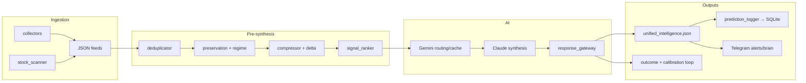

# Trading Copilot

An AI trading intelligence platform for Indian equities — multi-source ingestion, contradiction-aware synthesis, regime detection, reliability-gated outputs, Telegram intelligence delivery, and long-term calibration analytics.

Built as a **monolithic FastAPI service** on Railway with SQLite + JSON persistence. A local Electron GUI connects to the cloud API for operator review, calibration, and observability.

---

## Project Overview

Trading Copilot is not a single-model chatbot. It is a layered intelligence system that:

1. **Ingests** market, news, government, social, and scanner signals into structured JSON artifacts
2. **Preserves** contradictions and regime context instead of flattening them away
3. **Compresses** large inputs via Gemini when deltas warrant it (semantic cache + budget controls)
4. **Synthesizes** unified intelligence via Claude with memory-augmented self-calibration
5. **Validates** every synthesis through a reliability gateway (schema, hallucination checks, confidence calibration)
6. **Delivers** filtered Telegram alerts and on-demand brain commands
7. **Tracks** outcomes across horizons and builds calibration dashboards over time

The platform optimizes for **reliability-first AI**, **low-noise signals**, and **operator clarity** — not alert volume or dashboard clutter.

---

## Core Features

| Area | Capability |
|------|------------|
| **Multi-source intelligence** | India/global markets, news, Inshorts, YouTube, Reddit, Twitter/Nitter, govt (PIB/SEBI/RBI), NSE announcements, optional Telethon sentiment |
| **NSE scanner** | Volume spikes, breakouts, sector rotation across a configurable universe |
| **AI orchestration** | Gemini Flash for compression/routing; Claude Sonnet/Haiku for synthesis; daily budget gating |
| **Contradiction preservation** | Explicit contradiction scoring, retention metrics, sentiment diversity |
| **Regime detection** | Adaptive regime labels, delta analysis, intraday transition logging |
| **Reliability layer** | Pydantic schemas, hallucination detection, max-1 retry, safe fallback to last-valid intelligence |
| **Telegram engine** | Event-driven alerts, cooldown/dedupe/confidence filters, 6-message brain push, 20+ commands |
| **Outcome tracking** | Predictions + scanner signals + unified `signal_events` / `signal_horizons` evaluation |
| **Daily intelligence review** | Market-day classification, highlights, regime timeline, reliability warnings |
| **Calibration analytics** | Regime/day-type performance, confidence buckets, signal-type accuracy, Telegram precision |
| **OPS observability** | Live debug drawer: preservation, routing, compression, quality, reliability, calibration |
| **Watchdog recovery** | Stale-data detection with market-hours-aware thresholds; auto-refresh + optional Telegram alert |
| **Adaptive scheduling** | IST cron for strategic runs, intraday scans, post-market pipeline, alert ticks |

---

## Architecture

### Deployment model

```
┌─────────────────────────────────────────────────────────────────────────┐
│  Railway (single replica, TZ=Asia/Kolkata)                              │
│  uvicorn backend.api.api_server:app                                     │
│    ├── FastAPI HTTP API (X-API-Key auth)                                │
│    ├── Background: master_scheduler.py (IST cron)                       │
│    ├── Background: telegram_listener.py (command poll)                  │
│    └── Background: stale-data watchdog                                  │
│                                                                         │
│  Persistent volume: /app/data                                           │
│    ├── trading_history.db          (SQLite)                             │
│    ├── unified_intelligence.json   (latest brain output)                │
│    ├── stats_data.json / history_data.json                              │
│    ├── daily_reviews/              (end-of-day snapshots)               │
│    ├── debug_snapshots/            (pipeline observability)             │
│    └── source JSON feeds           (markets, news, scanner, …)          │
└─────────────────────────────────────────────────────────────────────────┘
         │                                    │
         ▼                                    ▼
  Telegram (24/7)                    Electron GUI (local)
  alerts + commands                    reads API → Intelligence Hub
```

### Backend layout

```
backend/
├── api/api_server.py           # FastAPI entry + background threads
├── orchestration/              # Scheduler, alerts, Telegram listener/brain
├── collectors/                 # Ingestion → data/*.json
├── analyzers/                  # Scanner, master analyzer, logging, outcomes
├── ai/                         # Compression, preservation, routing, dedup, rank
│   └── reliability/            # Response gateway, schemas, hallucination control
├── analytics/                  # Outcomes, calibration, daily review, journal
├── storage/                    # SQLite, JSON I/O, stats/history exporters
├── metrics/                    # execution_metrics.json counters
└── utils/                      # Config, Angel One client, market hours, locks
```

### Frontend (local only)

```
frontend/
├── main.js                     # Electron shell
├── index.html                  # Intelligence Hub UI (9 tabs + drawers)
└── components/
    ├── AIOpsPanel.js           # OPS operator console
    └── DailyReviewPanel.js     # Today's strategic review drawer
```

Railway deploys **Python only** (`nixpacks.toml` — no Node/npm). The Electron GUI runs on your machine and talks to the cloud API.

---

## Intelligence Flow



**Typical full cycle** (`run_full_cycle` in `master_scheduler.py`):

1. `collector.py` — India equities (Angel One primary, Yahoo fallback)
2. Parallel collectors — global, news, NSE, Inshorts, YouTube, govt, Telegram scraper, Twitter, Reddit
3. `stock_scanner.py` — technical signals
4. `master_analyzer.py` — compression → preservation → Claude → reliability gateway
5. Optional `telegram_brain_pusher.py` after strategic runs

**Post-market pipeline** (Mon–Fri 15:45 IST):

1. `outcome_tracker.py`
2. `stats_exporter.py` (includes calibration dashboard)
3. `history_exporter.py` (includes intelligence journal)
4. `daily_review_engine.build_daily_review()`
5. Full analysis cycle (`Post-Market`)

---

## AI Pipeline

| Stage | Module | Role |
|-------|--------|------|
| Dedup | `ai/deduplicator.py` | Remove duplicate news/reddit/govt/scanner items |
| Preservation | `ai/intelligence_preservation.py` | Contradictions, regime, scored signals, quality IQ |
| Compression | `ai/intelligence_compressor.py` | Delta detection; Gemini compression; skip/reuse |
| Ranking | `ai/signal_ranker.py` | Prioritize scanner/govt/news for prompts |
| Routing | `ai/ai_pipeline_router.py` | Cheap vs expensive path; prompt-hash semantic cache |
| Budget | `ai/ai_budget_manager.py` | Daily spend cap; low-cost mode |
| Synthesis | `analyzers/master_analyzer.py` | Claude unified intelligence + memory injection |
| Gateway | `ai/reliability/response_gateway.py` | Validate → detect hallucinations → calibrate → retry/fallback |
| Logging | `analyzers/prediction_logger.py` | Parse opportunities/risks into SQLite |
| Memory | `analyzers/learning_engine.py` | Historical win rates injected into prompts |

### Reliability gateway behavior

All Claude synthesis passes through `process_intelligence_synthesis()`:

1. **Pydantic schema validation** (`schemas.py`)
2. **Hallucination checks** — unknown tickers, invalid percentages, malformed JSON
3. **Confidence calibration** — band adjustment from historical behavior
4. **One retry** with simplified JSON-only prompt if blocking issues found
5. **Safe fallback** to `data/last_valid_intelligence.json` if validation still fails
6. **Metrics** recorded in `data/execution_metrics.json`

Telegram alerts load intelligence through the trusted path — degraded/fallback outputs are gated.

---

## Intelligence Surfaces (OPS / Calib / Journal / Review)

Four distinct operator surfaces — intentionally separated:

| Surface | Location | Purpose |
|---------|----------|---------|
| **OPS** | Topbar `OPS` drawer | **Live** operational telemetry: preservation, routing, compression, quality, reliability, calibration debug, watchdog health |
| **Calib** | Intelligence Hub tab `📊 Calib` | **Long-term** calibration: win rate, day-type performance, confidence buckets, signal-type accuracy, Telegram precision, health scores |
| **Journal** | Intelligence Hub tab `📜 Journal` | **Historical** strategic replay: daily review cards, regime timelines, warnings, COPY DAILY REVIEW |
| **Review** | Topbar `REVIEW` drawer | **Today's** compact end-of-day summary (same engine as journal cards, optimized for quick scan) |

OPS polls debug endpoints every 8s when open. Calib and Journal read exported JSON via `/api/all` (`stats_data.json`, `history_data.json`).

---

## Market Intelligence

### Data sources

| Source | Output | Notes |
|--------|--------|-------|
| Angel One SmartAPI | Primary India equity LTP | Via `utils/angel_one_client.py` |
| Yahoo Finance | Indices + fallback equities | Used when Angel fails; indices always Yahoo |
| News aggregator | `news_feed.json` | Multiple API keys when configured |
| Govt tracker | `govt_intelligence.json` | PIB/SEBI/RBI/BSE with translation |
| Stock scanner | `scanner_data.json` | ULTRA/STRONG/MEDIUM signals |
| Social | Reddit, Twitter, YouTube, Inshorts | Retail + media sentiment |

Market source health is tracked in `market_source_status.json`. Degraded feeds trigger reliability warnings in daily review.

### Regime & contradictions

`intelligence_preservation.py` computes:

- Regime labels and transition reasons
- Disagreement / contradiction intensity
- Sentiment diversity and preservation scores
- Intelligence Quality (IQ) composite score

These feed both synthesis quality gates and the daily review / calibration systems.

---

## Daily Intelligence Review

`backend/analytics/daily_review_engine.py` builds end-of-day snapshots persisted to `data/daily_reviews/review_YYYY-MM-DD.json`.

**Market-day classification** (rule-based, from existing signals — no external APIs):

- TRENDING DAY · SIDEWAYS CHOP · PANIC VOLATILE · REGIME TRANSITION
- MACRO SHOCK · EXPIRY VOLATILITY · LOW LIQUIDITY · MIXED SESSION

Each review includes:

- AI performance summary (signals, useful, false positives, suppressed alerts)
- Top winners / failures / contradictions
- Regime transition timeline
- Reliability warnings (contradiction retention, cache reuse, fallbacks, hallucinations)
- Telegram effectiveness
- Operator observation paragraph + **copy-ready summary text**

API: `GET /api/daily-review?date=&rebuild=`

---

## Calibration Analytics

Lightweight SQLite + JSON analytics — no vector DB, no external analytics infra.

| Module | Function |
|--------|----------|
| `signal_outcomes.py` | Unified event tracking; 15m/1h/intraday horizons; ops calibration payload |
| `regime_analytics.py` | Performance by market-day type; calibration health scores |
| `confidence_calibration.py` | Numeric buckets (0.8–1.0, 0.6–0.8, …) vs actual hit rate |
| `signal_performance_tracker.py` | Category accuracy (ULTRA breakouts, macro alerts, …) |
| `daily_journal_engine.py` | Rolling journal cards from daily reviews |

Exported into:

- `stats_data.json` → `calibration_dashboard` (Calib tab)
- `history_data.json` → `intelligence_journal` (Journal tab)

APIs: `GET /api/calibration` · `GET /api/journal?limit=21`

Calibration becomes statistically meaningful after sufficient evaluated horizons (typically days–weeks of market sessions).

---

## Intelligence Hub (GUI)

### Tabs

| Tab | Data source | Content |
|-----|-------------|---------|
| 🧠 Brain | `unified_intelligence.json` | Executive summary, mood, govt impact, opportunities, risks, self-calibration |
| 🏛️ Govt | `govt_intelligence.json` | High-impact announcements, affected stocks |
| 📈 Scan | `scanner_data.json` | ULTRA/STRONG signals, sector rotation |
| 📊 Mkt | markets JSON | India watchlist + global indices |
| 📰 News | news + Inshorts | Sentiment, hot stocks |
| 📺 TV | `youtube_feed.json` | Channel buzz, mentions |
| 🤖 Rdt | `reddit_data.json` | Retail sentiment |
| 📊 Calib | `stats_data.json` | AI Calibration Dashboard |
| 📜 Journal | `history_data.json` | Intelligence Journal + legacy prediction timeline |

### Topbar

- Broker/news webview shortcuts (Angel, Zerodha, ET, NSE, …)
- **REVIEW** — today's strategic drawer
- **OPS** — live observability drawer
- **API** status — connection to Railway
- **LIVE** badge

Embedded **Ask AI** bar supports Gemini (free), Haiku, and Sonnet via `POST /api/ask`.

---

## Observability

### OPS console (`AIOpsPanel.js`)

Sections backed by debug endpoints:

| Section | Endpoint |
|---------|----------|
| System Status | `/api/health` |
| Live AI Timeline | `/api/debug/explanations` |
| Preservation Inspector | `/api/debug/preservation` |
| AI Routing | `/api/debug/ai-routing` |
| Compression | `/api/debug/compression` |
| Delta Analysis | `/api/debug/delta-analysis` |
| Quality Metrics | `/api/debug/quality` |
| Telegram Alerts | `/api/debug/telegram-alerts` |
| AI Reliability | `/api/debug/reliability` |
| Outcome Learning | `/api/debug/calibration` |

Background alert polling uses `/api/health` + `/api/debug/explanations` every 30s.

### Structured metrics

`backend/metrics/execution_metrics.json` tracks AI latency, cache hits/misses, validation retries, hallucinations, schema failures, safe fallbacks, Telegram suppressions.

### Debug snapshots

Pipeline cycles write to `data/debug_snapshots/<cycle_id>/` — preserved signals, compression output, quality metrics, contradictions, routing decisions.

---

## API Reference

Public (no auth): `/` · `/api/config` · `/api/health`

Authenticated (`X-API-Key` header when `API_KEY` is set):

| Method | Path | Description |
|--------|------|-------------|
| GET | `/api/all` | Bulk fetch all GUI JSON blobs |
| GET | `/api/intelligence` … `/api/history` | Individual feeds |
| POST | `/api/ask` | Ask AI with intelligence context |
| POST | `/api/postmortem` | Forensic analysis of a failed prediction |
| POST | `/api/history/custom` | Custom date-range history |
| POST | `/api/refresh` | Background master analyzer run |
| GET | `/api/daily-review` | Daily intelligence review |
| GET | `/api/calibration` | Calibration dashboard |
| GET | `/api/journal` | Intelligence journal entries |
| GET/POST | `/api/debug/*` | Operator debug endpoints |

---

## Scheduler (IST)

| Schedule | Job |
|----------|-----|
| Daily 05:00 | Overnight Brief (full cycle) |
| Daily 08:00 | Outcome tracker (1d/3d/7d evaluation) |
| Daily 08:45 | Pre-Market (full cycle) |
| Daily 12:00 | Midday (full cycle) |
| Mon–Fri 09:30–15:30 every 30m | Intraday scan + analysis |
| Mon–Fri 15:45 | Post-market pipeline |
| Daily 23:00 | US Pulse (full cycle) |
| Every 30 min | Market-hours-aware collection |
| Every 1 min | Alert scheduler tick |
| Every 15 min | Signal horizon evaluation (market hours) |

Singleton process lock prevents duplicate schedulers. Watchdog in `api_server.py` auto-refreshes stale intelligence with cooldown protection.

---

## Telegram

### Commands (representative)

| Category | Commands |
|----------|----------|
| Brain | `/brain` `/summary` `/opps` `/risks` `/action` `/calibration` `/sectors` `/global` |
| ML | `/elite` — meta-labeler filtered setups |
| Pipelines | `/refresh` `/scan` `/brief` `/outcomes` `/history` |
| Info | `/status` `/stats` `/ask <question>` |
| Control | `/silence <min>` `/unsilence` `/help` |

### Alert engine

`telegram_alert_engine.py` + `alert_filters.py`:

- Confidence gates, cooldowns, duplicate blocking
- Suppression observability in `telegram_alert_observability.json`
- Emergency macro/regime alerts bypass some filters
- Intelligence loaded via reliability-trusted path

---

## Database Schema

SQLite: `data/trading_history.db`

| Table | Purpose |
|-------|---------|
| `predictions` | AI recommendations with entry/target/stop/confidence |
| `signals` | Scanner ULTRA/STRONG/MEDIUM events |
| `outcomes` | WIN/LOSS/NEUTRAL with 1d/3d/7d price tracking |
| `accuracy_metrics` | Aggregated win rates and profit factor |
| `signal_events` | Unified outcome-learning events |
| `signal_horizons` | Per-horizon HIT/MISS evaluation (15m, 1h, intraday, …) |
| `context_snapshots` | Forensic market state at prediction time |

---

## Deployment (Railway)

### Prerequisites

- GitHub repo connected to Railway
- **Persistent volume** mounted at `/app/data`
- Environment variables set (see Configuration)
- Billing limit recommended (~$15/month)

### Build & start

Railway uses Nixpacks (`nixpacks.toml`):

```bash
TZ=Asia/Kolkata uvicorn backend.api.api_server:app --host 0.0.0.0 --port $PORT
```

Same command in `Procfile` and `railway.json`. Python 3.11 + `tzdata`.

### Verify

```bash
curl https://your-app.railway.app/api/health
curl -H "X-API-Key: YOUR_KEY" https://your-app.railway.app/api/all
```

### Startup flow

1. Uvicorn loads FastAPI app
2. Config/bootstrap initializes `data/`, loads env
3. Background thread starts `master_scheduler.py` (unless `DISABLE_SCHEDULER=1`)
4. Background thread starts `telegram_listener.py` (unless `DISABLE_TELEGRAM_LISTENER=1`)
5. Watchdog thread monitors intelligence freshness

---

## Local Development

### Backend only

```bash
git clone <repo>
cd trading-copilot
pip install -r requirements.txt

# Configure keys (see Configuration)
cp .env.example config/keys.env   # edit with your keys

# Run API + scheduler + Telegram (same as Railway)
python -m uvicorn backend.api.api_server:app --host 0.0.0.0 --port 8000
```

Or run scheduler standalone:

```bash
python backend/master_scheduler.py
```

Validate `requirements.txt` encoding before deploy (Windows UTF-16 issues):

```bash
python scripts/validate_requirements_encoding.py
```

### Electron GUI

```bash
cd frontend
npm install
npm start
```

GUI reads `API_BASE_URL` and `API_KEY` from `config/keys.env`. Default API URL is set in `index.html`; override via env.

Set `USE_API = false` in `index.html` only if you want direct local JSON reads from `data/` (offline mode).

---

## Configuration

Env load order: `/app/config/keys.env` → `config/keys.env` → `.env` (Railway vars win — `override=False`).

### Required for core operation

| Variable | Purpose |
|----------|---------|
| `ANTHROPIC_API_KEY` | Claude synthesis |
| `GOOGLE_API_KEY` or `GEMINI_API_KEY` | Gemini compression/routing |
| `TELEGRAM_BOT_TOKEN` | Bot send/listen |
| `TELEGRAM_CHAT_ID` | Whitelisted chat |
| `API_KEY` | FastAPI `X-API-Key` auth (recommended in production) |

### Market data

| Variable | Purpose |
|----------|---------|
| `ANGEL_API_KEY` | Angel One SmartAPI |
| `ANGEL_CLIENT_ID` | Client ID |
| `ANGEL_PIN` | PIN |
| `ANGEL_TOTP_SECRET` | TOTP for session |

Without Angel credentials, collector falls back to Yahoo.

### Optional ingestion

| Variable | Purpose |
|----------|---------|
| `NEWS_API_KEY` | News aggregator |
| `MARKETAUX_KEY` | MarketAux |
| `FINNHUB_KEY` | Finnhub |
| `YOUTUBE_API_KEY` | YouTube tracker |
| `TELEGRAM_API_ID` / `TELEGRAM_API_HASH` / `TELEGRAM_SESSION_STRING` | Telethon scraper |

### Runtime controls

| Variable | Default | Purpose |
|----------|---------|---------|
| `PORT` | 8000 | API port |
| `DISABLE_SCHEDULER` | — | Set `1` to skip scheduler thread |
| `DISABLE_TELEGRAM_LISTENER` | — | Set `1` to skip listener thread |
| `MAX_DAILY_AI_COST` | 1.5 | Daily AI spend cap (USD) |
| `AI_CACHE_TTL_SECONDS` | 21600 | Semantic cache TTL |
| `STALE_THRESHOLD_SECONDS` | 7200 | Base watchdog stale threshold |
| `WATCHDOG_CHECK_INTERVAL` | 300 | Watchdog poll interval |
| `WATCHDOG_TRIGGER_COOLDOWN` | 1800 | Min seconds between auto-refreshes |
| `AI_USE_CASE` | — | Run label (e.g. `watchdog_refresh`) |

Quality warning thresholds: `QUALITY_SCORE_WARN`, `CONTRADICTION_RETENTION_WARN`, `COMPRESSION_RATIO_WARN`, `SENTIMENT_PRESERVATION_WARN`.

---

## Operator Workflow

### During market hours

1. Monitor **OPS** for preservation drops, routing anomalies, or reliability warnings
2. Use **Brain** tab or Telegram `/brain` for latest synthesis
3. Trust Telegram alerts only when reliability gate passed (check OPS if uncertain)

### End of day

1. Post-market pipeline builds stats, history, and daily review (~15:45 IST)
2. Open **Journal** tab for historical cards — or **REVIEW** drawer for today
3. **COPY DAILY REVIEW** for calibration discussions

### Weekly calibration

1. Open **Calib** tab — review day-type accuracy and confidence buckets
2. Check false-positive rate by signal category
3. Adjust confidence gates / Telegram filters based on evidence, not intuition

### When things break

1. `/api/health` — file freshness and lock status
2. OPS → Watchdog / Health section
3. `/api/debug/reliability` — fallback/hallucination counts
4. Logs in Railway dashboard; structured tags via `structured_log.py`

---

## Philosophy

| Principle | Implementation |
|-----------|----------------|
| **Reliability-first AI** | Gateway validates every synthesis; fallback preserves last good state |
| **Contradiction awareness** | Preservation layer scores and retains disagreement — not silent averaging |
| **Low-noise signals** | Telegram filters, suppression tracking, usefulness metrics over volume |
| **Adaptive regimes** | Day-type classification drives calibration, not one global threshold |
| **Honest calibration** | Confidence buckets compared to actual hit rates; insufficient samples shown explicitly |
| **Operator clarity** | OPS / Calib / Journal / Review separation — no debug clutter in strategic views |

---

## Security

- API keys in `config/keys.env` (gitignored) or Railway env vars
- FastAPI endpoints require `X-API-Key` when `API_KEY` is set
- Telegram commands restricted to configured `TELEGRAM_CHAT_ID`
- Private repository recommended
- `data/*.db`, `data/*.json`, and runtime artifacts are gitignored

---

## Disclaimer

This is a personal research and intelligence platform. **Not financial advice.** Past signal performance does not guarantee future results. Consult a SEBI-registered advisor before trading.

---

## Key Dependencies

| Package | Role |
|---------|------|
| `fastapi` / `uvicorn` | HTTP API |
| `pydantic` | Reliability schemas |
| `anthropic` / `google-generativeai` | AI providers |
| `smartapi-python` / `pyotp` | Angel One |
| `yfinance` / `pandas` | Market data fallback |
| `schedule` | IST cron |
| `python-telegram-bot` | Bot API |
| `telethon` | Optional sentiment scraper |
| `xgboost` / `scikit-learn` | Meta-labeler (optional ML filter) |
| `praw` | Reddit |
