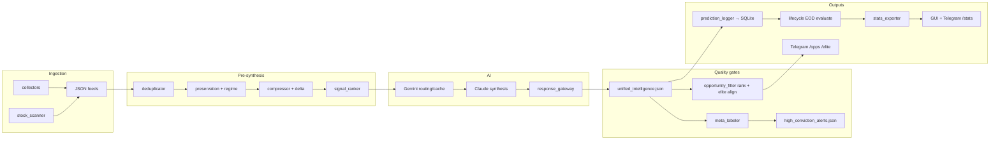

# Trading Copilot

Production-grade AI trading intelligence for Indian equities — multi-source ingestion, contradiction-aware synthesis, regime detection, reliability-gated outputs, meta-labeler elite filtering, adaptive calibration, Telegram delivery, and long-term outcome learning.

Built as a **monolithic FastAPI service** on Railway with SQLite + JSON persistence. A local Electron GUI connects to the cloud API for operator review, calibration, and observability.

---

## Overview

Trading Copilot is not a single-model chatbot. It is a layered intelligence system that:

1. **Ingests** market, news, government, social, and scanner signals into structured JSON artifacts
2. **Preserves** contradictions and regime context instead of flattening them away
3. **Compresses** large inputs via Gemini when deltas warrant it (semantic cache + budget controls)
4. **Synthesizes** unified intelligence via Claude with memory-augmented self-calibration
5. **Validates** every synthesis through a reliability gateway (schema, hallucination checks, confidence calibration)
6. **Filters** opportunities through scanner ranking + meta-labeler elite alignment (>72% ML probability)
7. **Delivers** filtered Telegram alerts and on-demand brain commands (capped `/opps` at 10)
8. **Tracks** outcomes across horizons, expires stale pending predictions, and builds calibration dashboards
9. **Self-heals** bounded operational failures without aggressive restarts or duplicate orchestrators

The platform optimizes for **reliability-first AI**, **low-noise signals**, **confidence consistency**, and **operator clarity** — not alert volume or dashboard clutter.

**Current phase:** 2-week observational calibration — production refinement freeze with adaptive learning enabled.

---

## Features

| Area | Capability |
|------|------------|
| **Multi-source intelligence** | India/global markets, news, Inshorts, YouTube, Reddit, Twitter/Nitter, govt (PIB/SEBI/RBI), NSE announcements, optional Telethon sentiment |
| **NSE scanner** | Volume spikes, breakouts, sector rotation across a configurable universe |
| **Meta-labeler elite gate** | `high_conviction_alerts.json` — only >72% ML probability setups are elite HIGH |
| **Elite/scanner alignment** | `/opps` downgrades non-elite HIGH → WATCHLIST with visible "Below elite threshold" |
| **AI orchestration** | Gemini Flash for compression/routing; Claude Sonnet/Haiku for synthesis; daily budget gating |
| **Provider pools** | Multi-provider routing with quota tracking, degraded-mode fallback, runtime analytics |
| **Contradiction preservation** | Explicit contradiction scoring, retention metrics, sentiment diversity, macro conflict penalties |
| **Regime detection** | Adaptive regime labels, panic-mode stricter thresholds, intraday transition logging |
| **Reliability layer** | Pydantic schemas, hallucination detection, max-1 retry, safe fallback to last-valid intelligence |
| **Retrieval-first /ask** | Elite rankings, ranked opps, calibration, regime context before LLM explanation |
| **Telegram engine** | Event-driven alerts, cooldown/dedupe/confidence filters, brain push, 20+ commands |
| **Outcome tracking** | Predictions + scanner signals + unified `signal_events` / `signal_horizons` evaluation |
| **Prediction lifecycle** | ACTIVE → PENDING → WIN/LOSS/EXPIRED with TTL, confidence decay, unresolved timeout |
| **Adaptive calibration** | Regime/day-type performance, confidence buckets, lifecycle-synced stats export |
| **Daily intelligence review** | Market-day classification, highlights, regime timeline, reliability warnings |
| **OPS observability** | Live debug drawer: preservation, routing, compression, quality, reliability, lifecycle |
| **Night mode calmness** | Idle banners overnight — no false "STALE" lifecycle warnings after successful EOD |
| **Self-healing** | Bounded recovery loop — cooldown, max attempts/hour, export-only replay first |
| **Local runtime** | `run_local.py` for dev parity with Railway |

---

## Architecture

### Deployment model

```
┌─────────────────────────────────────────────────────────────────────────┐
│  Railway (single replica, TZ=Asia/Kolkata)                              │
│  uvicorn backend.api.api_server:app                                     │
│    ├── FastAPI HTTP API (X-API-Key auth)                                │
│    ├── Background: master_scheduler.py (IST cron)                       │
│    ├── Background: telegram_listener.py (command poll)                │
│    ├── Background: recovery_loop.py (bounded self-healing)              │
│    └── Background: stale-data watchdog                                  │
│                                                                         │
│  Persistent volume: /app/data                                           │
│    ├── trading_history.db          (SQLite)                             │
│    ├── unified_intelligence.json   (latest brain output)                │
│    ├── high_conviction_alerts.json (meta-labeler elite output)          │
│    ├── stats_data.json / history_data.json                              │
│    ├── active_predictions.json     (lifecycle ACTIVE/PENDING export)    │
│    ├── lifecycle_state.json        (EOD pipeline state)                 │
│    ├── daily_reviews/              (end-of-day snapshots)               │
│    ├── debug_snapshots/            (pipeline observability)             │
│    └── source JSON feeds           (markets, news, scanner, …)          │
└─────────────────────────────────────────────────────────────────────────┘
         │                                    │
         ▼                                    ▼
  Telegram (24/7)                    Electron GUI (local)
  alerts + commands                    reads API → Intelligence Hub
```

### Backend layout

```
backend/
├── api/api_server.py           # FastAPI entry + background threads + runtime panels
├── orchestration/              # Scheduler, alerts, Telegram, opportunity filter, recovery
├── collectors/                 # Ingestion → data/*.json
├── analyzers/                  # Scanner, master analyzer, meta_labeler, outcomes
├── ai/                         # Compression, routing, ask_context_builder, reliability
│   └── reliability/            # Response gateway, schemas, hallucination control
├── adaptive/                   # Adaptive calibration engine
├── analytics/                  # Outcomes, calibration, daily review, journal
├── lifecycle/                  # Prediction lifecycle engine, rules, evaluator
├── storage/                    # SQLite, JSON I/O, stats/history exporters
├── metrics/                    # execution_metrics.json counters
└── utils/                      # Config, Angel One, market_hours, locks, local_runtime
```

### Frontend (local only)

```
frontend/
├── main.js                     # Electron shell
├── index.html                  # Intelligence Hub UI (9 tabs + drawers)
├── runtime/runtimeManager.js   # Snapshot cache, panel state, night-mode banners
└── components/
    ├── AIOpsPanel.js           # OPS operator console
    └── DailyReviewPanel.js     # Today's strategic review drawer
```

Railway deploys **Python only** (`nixpacks.toml` — no Node/npm). The Electron GUI runs on your machine and talks to the cloud API.

---

## Runtime Flow



**Typical full cycle** (`run_full_cycle` in `master_scheduler.py`):

1. `collector.py` — India equities (Angel One primary, Yahoo fallback)
2. Parallel collectors — global, news, NSE, Inshorts, YouTube, govt, Telegram scraper, Twitter, Reddit
3. `stock_scanner.py` — technical signals
4. `master_analyzer.py` — compression → preservation → Claude → reliability gateway
5. `meta_labeler.py` — elite probability gate (>72%)
6. Optional `telegram_brain_pusher.py` after strategic runs

---

## AI Provider System

| Provider | Role | Pool behavior |
|----------|------|---------------|
| **Gemini Flash** | Compression, routing, cheap asks | Primary cheap path; semantic cache |
| **Claude Sonnet/Haiku** | Strategic synthesis, Telegram ask | Budget-gated; reliability gateway |
| **Groq** (optional) | Fallback routing | Degraded-mode when primary quota hit |

Modules: `ai_router.py`, `provider_manager.py`, `ai_budget_manager.py`, `ai_pipeline_router.py`

Runtime analytics exported to `stats_data.json` → `ai_runtime` and `data/provider_analytics/`.

Daily spend cap via `MAX_DAILY_AI_COST`. Low-cost mode activates when budget threshold approached.

---

## Adaptive Calibration

| Module | Function |
|--------|----------|
| `adaptive/adaptive_calibration_engine.py` | Rolling threshold adjustment from outcome history |
| `analytics/regime_analytics.py` | Performance by market-day type; calibration health scores |
| `analytics/confidence_calibration.py` | Numeric buckets vs actual hit rate |
| `analytics/signal_performance_tracker.py` | Category accuracy (ULTRA breakouts, macro alerts, …) |
| `lifecycle/prediction_lifecycle_engine.py` | EOD evaluation → stats/history/calibration sync |

**Single source of truth for stats:** `db_manager.calculate_accuracy_metrics()` → `stats_exporter.export_stats()` → `stats_data.json`

- `total_evaluated` = resolved outcomes only (WIN, LOSS, PARTIAL, NEUTRAL, EXPIRED, INVALIDATED)
- `pending` = PENDING + UNRESOLVED + NULL verdicts (shown separately)
- `/stats` and `/outcomes` read the same export; `/outcomes` refreshes stats on demand

Calibration becomes statistically meaningful after ≥30 evaluated predictions (`ADAPTIVE_MIN_GLOBAL`).

---

## Prediction Lifecycle

States: `ACTIVE` → `PENDING` → `WIN` | `LOSS` | `PARTIAL` | `EXPIRED` | `INVALIDATED`

| Rule | Default |
|------|---------|
| Signal TTL | 1–5 sessions by signal type (`lifecycle_rules.py`) |
| Hard expiry cap | 7 days (`EXPIRE_AFTER_DAYS`) |
| UNRESOLVED timeout | 5 days (`UNRESOLVED_EXPIRE_DAYS`) |
| Confidence decay | HIGH→MEDIUM after 4 sessions; MEDIUM→LOW after 6 |
| Regime invalidation | Bullish opps invalidated under bearish regime |

**Post-market EOD pipeline** (Mon–Fri ~15:45 IST):

1. `expire_stale_pending()` — expire aged pending, decay confidence
2. `outcome_tracker.py` — price evaluation
3. `stats_exporter.py` — unified metrics + calibration dashboard
4. `history_exporter.py` — journal + prediction timeline
5. `daily_review_engine.build_daily_review()`
6. Full analysis cycle (`Post-Market`)

Lifecycle status exported via `get_lifecycle_status()` — overnight shows **IDLE** ("Lifecycle idle until next market session") after successful EOD, not alarming STALE.

---

## Telegram Commands

| Category | Commands |
|----------|----------|
| **Elite / ML** | `/elite` — meta-labeler setups (>72% only) |
| **Brain** | `/brain` `/summary` `/opps` `/risks` `/action` `/calibration` `/sectors` `/global` |
| **Pipelines** | `/refresh` `/scan` `/brief` `/outcomes` `/history` |
| **Info** | `/status` `/stats` `/ask <question>` |
| **Control** | `/silence <min>` `/unsilence` `/help` |

### Confidence labels (aligned)

| Label | Meaning |
|-------|---------|
| **HIGH** | Elite meta-labeler verified (>72% ML probability) |
| **MEDIUM** | Scanner-ranked, moderate conviction |
| **WATCHLIST** | Scanner signal below elite threshold |
| **SPECULATIVE** | Low conviction / weak evidence |

`/opps` capped at **10** (`TELEGRAM_OPPS_LIMIT`). Non-elite HIGH signals are never shown as elite HIGH.

`/ask` uses retrieval-first context (`ask_context_builder.py`) — elite, ranked opps, calibration, regime — before LLM summarization. No generic hallucinated picks.

---

## OPS Panel

Live operator console (`AIOpsPanel.js`) — polls debug endpoints every 8s when open.

| Section | Endpoint |
|---------|----------|
| System Status | `/api/health` |
| Lifecycle | `/api/debug/lifecycle` + runtime panels |
| Live AI Timeline | `/api/debug/explanations` |
| Preservation Inspector | `/api/debug/preservation` |
| AI Routing | `/api/debug/ai-routing` |
| Compression | `/api/debug/compression` |
| Quality Metrics | `/api/debug/quality` |
| AI Reliability | `/api/debug/reliability` |
| Outcome Learning | `/api/debug/calibration` |

Night mode: source freshness shows idle copy, lifecycle shows **IDLE** not STALE.

---

## Railway Deployment

### Prerequisites

- GitHub repo connected to Railway
- **Persistent volume** mounted at `/app/data`
- Environment variables set (see Environment Variables)
- Billing limit recommended (~$15/month)

### Build & start

```bash
TZ=Asia/Kolkata uvicorn backend.api.api_server:app --host 0.0.0.0 --port $PORT
```

Same command in `Procfile` and `railway.json`. Python 3.11 + `tzdata`.

### Verify

```bash
curl https://your-app.railway.app/api/health
curl -H "X-API-Key: YOUR_KEY" https://your-app.railway.app/api/all
```

### Startup flow

1. Uvicorn loads FastAPI app
2. Config/bootstrap initializes `data/`, loads env
3. Background thread starts `master_scheduler.py` (unless `DISABLE_SCHEDULER=1`)
4. Background thread starts `telegram_listener.py` (unless `DISABLE_TELEGRAM_LISTENER=1`)
5. Recovery loop starts with bounded cooldown (unless disabled)
6. Watchdog thread monitors intelligence freshness

---

## Local Development

### Backend only

```bash
git clone <repo>
cd trading-copilot
pip install -r requirements.txt
cp .env.example config/keys.env   # edit with your keys
python -m uvicorn backend.api.api_server:app --host 0.0.0.0 --port 8000
```

Or use the local runtime wrapper:

```bash
python run_local.py
```

Before daily local use, run the master readiness gate:

```bash
python scripts\local_system_readiness.py
```

Prints `[LOCAL_READY]` lines and `LOCAL_SYSTEM_READY` when all safety, database, report, intelligence, frontend, and scheduler checks pass.

### Live daily workflow

Start backend, GUI, then run live smoke:

```bash
python run_local.py
```

**Browser GUI (port 5173):**

```bash
cd frontend
npm install
npm run web
```

Open: http://127.0.0.1:5173

**Electron GUI (desktop):**

```bash
cd frontend
npm install
npm start
```

In another terminal:

```bash
python scripts\live_system_smoke.py --frontend-mode auto
```

Use `--frontend-mode auto` (default) to prefer the browser GUI on port 5173 when reachable, otherwise validate Electron source files. Use `--frontend-mode web --frontend-base http://127.0.0.1:5173` for explicit browser checks. Use `--frontend-mode electron` or `--skip-frontend` when only the desktop app is running.

Prints `[LIVE_SMOKE]` lines and `LIVE_SYSTEM_SMOKE_OK` when the running backend and Electron GUI checks pass.

GUI reads `API_BASE_URL` and `API_KEY` from `config/keys.env`.

Validate `requirements.txt` encoding before deploy:

```bash
python scripts/validate_requirements_encoding.py
```

---

## Environment Variables

Env load order: `/app/config/keys.env` → `config/keys.env` → `.env` (Railway vars win).

### Required

| Variable | Purpose |
|----------|---------|
| `ANTHROPIC_API_KEY` | Claude synthesis |
| `GOOGLE_API_KEY` or `GEMINI_API_KEY` | Gemini compression/routing |
| `TELEGRAM_BOT_TOKEN` | Bot send/listen |
| `TELEGRAM_CHAT_ID` | Whitelisted chat |
| `API_KEY` | FastAPI `X-API-Key` auth |

### Market data

| Variable | Purpose |
|----------|---------|
| `ANGEL_API_KEY` / `ANGEL_CLIENT_ID` / `ANGEL_PIN` / `ANGEL_TOTP_SECRET` | Angel One SmartAPI |

### Runtime controls

| Variable | Default | Purpose |
|----------|---------|---------|
| `TELEGRAM_OPPS_LIMIT` | 10 | Max `/opps` results |
| `EXPIRE_AFTER_DAYS` | 7 | Hard pending expiry cap |
| `UNRESOLVED_EXPIRE_DAYS` | 5 | UNRESOLVED verdict timeout |
| `DISABLE_SCHEDULER` | — | Set `1` to skip scheduler |
| `DISABLE_TELEGRAM_LISTENER` | — | Set `1` to skip listener |
| `MAX_DAILY_AI_COST` | 1.5 | Daily AI spend cap (USD) |
| `WATCHDOG_STALE_NIGHT` | 18000 | Night stale threshold (seconds) |

---

## Scheduler / EOD Flow

| Schedule (IST) | Job |
|----------------|-----|
| Daily 05:00 | Overnight Brief (full cycle) |
| Daily 08:00 | Outcome tracker (1d/3d/7d evaluation) |
| Daily 08:45 | Pre-Market (full cycle) |
| Daily 12:00 | Midday (full cycle) |
| Mon–Fri 09:30–15:30 every 30m | Intraday scan + analysis |
| Mon–Fri 15:45 | Post-market lifecycle + stats + review |
| Daily 23:00 | US Pulse (full cycle) |
| Every 30 min | Market-hours-aware collection |
| Every 1 min | Alert scheduler tick |

Singleton process lock prevents duplicate schedulers.

---

## Self-Healing

`recovery_loop.py` + `eod_recovery.py` — **observe, validate, recover bounded failures only**.

| Safeguard | Value |
|-----------|-------|
| Orchestrator cooldown | 900s between recovery attempts |
| Max recoveries/hour | 4 |
| Max partial EOD replays/session | 1 |
| Max EOD recoveries/day | 3 |
| Market-aware gates | No aggressive recovery overnight |
| Export-only replay | Preferred before full pipeline rerun |

**Does NOT:** restart aggressively, recursively rerun EOD, spawn duplicate orchestrators, or create infinite repair loops.

---

## Runtime Analytics

- `backend/metrics/execution_metrics.json` — AI latency, cache, validation retries, hallucinations
- `data/provider_analytics/` — daily provider trends
- `stats_data.json` → `ai_runtime` — GUI OPS provider section
- `data/debug_snapshots/<cycle_id>/` — preserved signals, contradictions, routing

API: runtime panels via `/api/all` → `runtime.panels`

---

## API Endpoints

Public: `/` · `/api/config` · `/api/health`

Authenticated (`X-API-Key`):

| Method | Path | Description |
|--------|------|-------------|
| GET | `/api/all` | Bulk fetch all GUI JSON blobs + runtime panels |
| GET | `/api/intelligence` … `/api/history` | Individual feeds |
| POST | `/api/ask` | Retrieval-first Ask AI |
| POST | `/api/refresh` | Background master analyzer run |
| GET | `/api/daily-review` | Daily intelligence review |
| GET | `/api/calibration` | Calibration dashboard |
| GET | `/api/journal` | Intelligence journal entries |
| GET | `/api/debug/*` | Operator debug endpoints |

---

## Troubleshooting

| Symptom | Check |
|---------|-------|
| GUI tabs stuck loading | Browser console for JS errors; `/api/health` connectivity |
| `/elite` empty but `/opps` shows items | Expected — opps are WATCHLIST unless elite-verified |
| Stats Evaluated ≠ Wins+Losses | Pending counted separately; run `/outcomes` to refresh export |
| Lifecycle STALE overnight | Should show IDLE after successful EOD; check `lifecycle_state.json` |
| Telegram duplicate messages | Commands use single status message; background tasks don't double-send |
| High pending count | EOD `expire_stale_pending` runs post-market; check `EXPIRE_AFTER_DAYS` |

Logs: Railway dashboard; structured tags via `structured_log.py`.

---

## Operational Modes

| Mode | Period (IST) | Behavior |
|------|--------------|----------|
| **HEALTHY ACTIVE** | 09:00–16:00 Mon–Fri | Full collectors, scanner, analyzer |
| **PRE-MARKET** | 06:00–09:00 | Awaiting open; light collection |
| **AFTER HOURS** | 17:00–23:00 | Post-close; lifecycle EOD |
| **NIGHT** | 23:00–06:00 | Collectors idle; calm status copy |
| **WEEKEND** | Sat–Sun | Idle until Monday open |
| **RECOVERING** | Any (market hours) | Bounded self-healing in progress |

Source: `backend/utils/market_hours.py` → `get_operational_status()`

---

## Night Mode

Overnight and weekends:

- File freshness shows 🌙 idle copy, not ❌ stale warnings
- Lifecycle status: **IDLE** — "Lifecycle idle until next market session"
- Telegram `/status` uses calm collector age formatting
- Watchdog stale threshold extended (`WATCHDOG_STALE_NIGHT` = 5h)
- Self-healing suppressed outside market-critical windows

---

## Known Safeguards

- Reliability gateway blocks degraded/fallback intelligence from Telegram alerts
- Meta-labeler elite gate (>72%) independent from scanner HIGH labels
- `/opps` hard-capped at 10 with quality ranking engine
- Panic regime stricter rank thresholds (`MIN_RANK_SCORE_PANIC`)
- Contradiction + macro conflict penalties in opportunity filter
- Process locks prevent duplicate scheduler/listener instances
- API key auth on all sensitive endpoints
- Telegram restricted to configured `TELEGRAM_CHAT_ID`

---

## Future Calibration Notes

During the 2-week observational phase:

1. Monitor elite vs scanner alignment — watch WATCHLIST conversion rates
2. Track calibration health scores as evaluated sample grows past 30
3. Review panic-regime false positives — adjust `MIN_RANK_SCORE_PANIC` if needed
4. Observe pending decay — target reduced ACTIVE/PENDING inflation
5. Compare `/ask` answers against elite/opps for grounding quality
6. Do **not** redesign architecture or rewrite orchestration during observation
7. Adjust confidence gates and TTL only with evidence from `stats_data.json` calibration dashboard

---

## Disclaimer

This is a personal research and intelligence platform. **Not financial advice.** Past signal performance does not guarantee future results. Consult a SEBI-registered advisor before trading.
